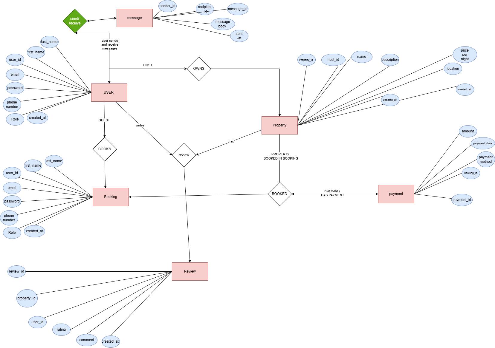

# Airbnb Clone – Database Design

This document outlines the core database schema for an Airbnb-style booking platform, including entities, attributes, relationships, and implementation in SQL. The schema supports functionalities such as user management, property listings, bookings, payments, reviews, and messaging.

---

## 📊 Entities & Attributes

### 🧑‍💼 User
- `user_id`: UUID, Primary Key
- `first_name`: VARCHAR, NOT NULL
- `last_name`: VARCHAR, NOT NULL
- `email`: VARCHAR, UNIQUE, NOT NULL
- `password_hash`: VARCHAR, NOT NULL
- `phone_number`: VARCHAR, NULL
- `role`: ENUM (`guest`, `host`, `admin`), NOT NULL
- `created_at`: TIMESTAMP, DEFAULT CURRENT_TIMESTAMP

---

### 🏡 Property
- `property_id`: UUID, Primary Key
- `host_id`: FK → User(`user_id`)
- `name`: VARCHAR, NOT NULL
- `description`: TEXT, NOT NULL
- `location`: VARCHAR, NOT NULL
- `pricepernight`: DECIMAL, NOT NULL
- `created_at`: TIMESTAMP, DEFAULT CURRENT_TIMESTAMP
- `updated_at`: TIMESTAMP, ON UPDATE CURRENT_TIMESTAMP

---

### 📅 Booking
- `booking_id`: UUID, Primary Key
- `property_id`: FK → Property(`property_id`)
- `user_id`: FK → User(`user_id`)
- `start_date`: DATE, NOT NULL
- `end_date`: DATE, NOT NULL
- `total_price`: DECIMAL, NOT NULL
- `status`: ENUM (`pending`, `confirmed`, `canceled`), NOT NULL
- `created_at`: TIMESTAMP, DEFAULT CURRENT_TIMESTAMP

---

### 💳 Payment
- `payment_id`: UUID, Primary Key
- `booking_id`: FK → Booking(`booking_id`)
- `amount`: DECIMAL, NOT NULL
- `payment_date`: TIMESTAMP, DEFAULT CURRENT_TIMESTAMP
- `payment_method`: ENUM (`credit_card`, `paypal`, `stripe`), NOT NULL

---

### 📝 Review
- `review_id`: UUID, Primary Key
- `property_id`: FK → Property(`property_id`)
- `user_id`: FK → User(`user_id`)
- `rating`: INTEGER (1 to 5), NOT NULL
- `comment`: TEXT, NOT NULL
- `created_at`: TIMESTAMP, DEFAULT CURRENT_TIMESTAMP

---

### 💬 Message
- `message_id`: UUID, Primary Key
- `sender_id`: FK → User(`user_id`)
- `recipient_id`: FK → User(`user_id`)
- `message_body`: TEXT, NOT NULL
- `sent_at`: TIMESTAMP, DEFAULT CURRENT_TIMESTAMP

---

## 🔗 Entity Relationships

- **User → Property** (1:N): A host can own many properties.
- **User → Booking** (1:N): A guest can make many bookings.
- **Property → Booking** (1:N): A property can have many bookings.
- **Booking → Payment** (1:1): Each booking has one payment.
- **User → Review** (1:N): A user can write many reviews.
- **Property → Review** (1:N): A property can have many reviews.
- **User → Message** (1:N): Users can send and receive messages.

---

## 🛠 SQL Schema

```sql
CREATE TABLE users (
    user_id UUID PRIMARY KEY,
    first_name VARCHAR(100) NOT NULL,
    last_name VARCHAR(100) NOT NULL,
    email VARCHAR(255) UNIQUE NOT NULL,
    password_hash VARCHAR(255) NOT NULL,
    phone_number VARCHAR(20),
    role VARCHAR(10) CHECK (role IN ('guest', 'host', 'admin')) NOT NULL,
    created_at TIMESTAMP DEFAULT CURRENT_TIMESTAMP
);

CREATE INDEX idx_users_email ON users(email);

CREATE TABLE properties (
    property_id UUID PRIMARY KEY,
    host_id UUID NOT NULL,
    name VARCHAR(255) NOT NULL,
    description TEXT NOT NULL,
    location VARCHAR(255) NOT NULL,
    pricepernight DECIMAL(10, 2) NOT NULL,
    created_at TIMESTAMP DEFAULT CURRENT_TIMESTAMP,
    updated_at TIMESTAMP DEFAULT CURRENT_TIMESTAMP ON UPDATE CURRENT_TIMESTAMP,
    FOREIGN KEY (host_id) REFERENCES users(user_id)
);

CREATE TABLE bookings (
    booking_id UUID PRIMARY KEY,
    property_id UUID NOT NULL,
    user_id UUID NOT NULL,
    start_date DATE NOT NULL,
    end_date DATE NOT NULL,
    total_price DECIMAL(10, 2) NOT NULL,
    status VARCHAR(10) CHECK (status IN ('pending', 'confirmed', 'canceled')) NOT NULL,
    created_at TIMESTAMP DEFAULT CURRENT_TIMESTAMP,
    FOREIGN KEY (property_id) REFERENCES properties(property_id),
    FOREIGN KEY (user_id) REFERENCES users(user_id)
);

CREATE TABLE payments (
    payment_id UUID PRIMARY KEY,
    booking_id UUID NOT NULL,
    amount DECIMAL(10, 2) NOT NULL,
    payment_date TIMESTAMP DEFAULT CURRENT_TIMESTAMP,
    payment_method VARCHAR(20) CHECK (payment_method IN ('credit_card', 'paypal', 'stripe')) NOT NULL,
    FOREIGN KEY (booking_id) REFERENCES bookings(booking_id)
);

CREATE TABLE reviews (
    review_id UUID PRIMARY KEY,
    property_id UUID NOT NULL,
    user_id UUID NOT NULL,
    rating INTEGER CHECK (rating BETWEEN 1 AND 5) NOT NULL,
    comment TEXT NOT NULL,
    created_at TIMESTAMP DEFAULT CURRENT_TIMESTAMP,
    FOREIGN KEY (property_id) REFERENCES properties(property_id),
    FOREIGN KEY (user_id) REFERENCES users(user_id)
);
```
#messages
```
CREATE TABLE messages (
    message_id UUID PRIMARY KEY,
    sender_id UUID NOT NULL,
    recipient_id UUID NOT NULL,
    message_body TEXT NOT NULL,
    sent_at TIMESTAMP DEFAULT CURRENT_TIMESTAMP,
    FOREIGN KEY (sender_id) REFERENCES users(user_id),
    FOREIGN KEY (recipient_id) REFERENCES users(user_id)
);
```

---

## ⚡️ Why Use Indexes?

Indexes help speed up searches and queries. For example:

```sql
CREATE INDEX idx_users_email ON users(email);
```

This makes queries like:

```sql
SELECT * FROM users WHERE email = 'user@example.com';
```

much faster by avoiding full table scans.

Indexes are crucial on:
- Frequently searched fields (`email`, `user_id`, `property_id`)
- Foreign keys (for faster joins)
- Fields used in `WHERE`, `JOIN`, `ORDER BY` clauses


---

## 📐 Diagram


